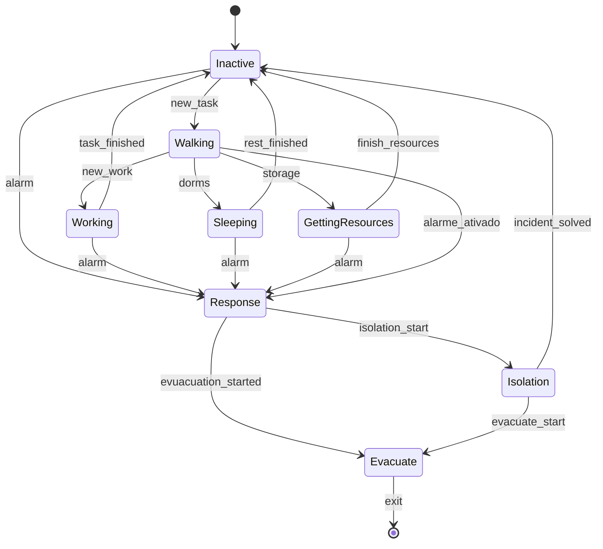
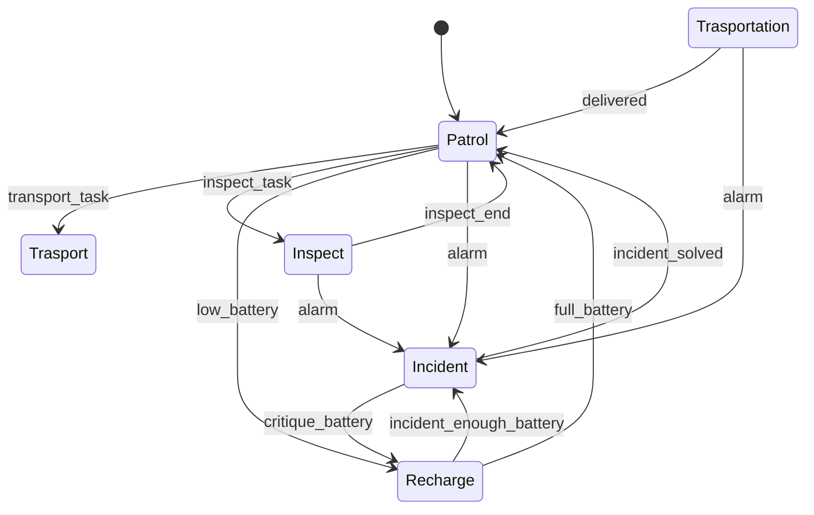

# Projeto 1 de Inteligência Artificial

**Inteligência Artificial - Licenciatura em Videojogos**
Universidade Lusófona, 2025/2026

---

## Autores

João Gonçalves [a21901696]
Simão Campaniço [a22510616]

---

## Distribuição do Trabalho

**João Gonçalves:**

**Simão Campaniço:** Fiz a implementação inicial do mapa, bem como os prefabs dos Agents e do Robô, faz o baked do mapa com o NavMesh e escrevi todo o relatório com a nossa pesquisa inicial do projeto sobre as condições para uma base em marte.

---

## Introdução

O projeto tem como base a simulação de uma colónia de humanos em Marte, composta por módulos que estão interligados entre si. O objetivo principal foi implementar em Unity essa mesma simulação com os agentes autónomos, divididos em tripulantes e robôs, que conseguem fazer as suas tarefas de dia-à-dia e reagir aos incidentes que podem acontecer no interior da base. Esses mesmos incidentes são: incêndio, fuga de oxigénio e falha elétrica.

A simulação baseada em agentes (_agent-based simulation_) é uma abordagem que modela os sistemas através do comportamento individual das entidades. Na robótica e na gestão de emergências, este tipo de modelo é aplicado nos cenários de evacuação, na coordenação de sistemas de robôs e na coordenação dos mesmos. Helbing, Farkas e Vicsek (2000) fizeram um trabalho sobre dinâmicas de pânico nas evacuações, que demonstra que mesmo com regras de movimento simples podem-se observar alguns fenómenos, como o efeito de "arco" nas saídas, que faz com que o fluxo dos evacuados seja reduzido. Essa ideia foi um dos aspetos que desde o início quisemos observar e procurar durante os nossos testes.

Na parte de design do habitat, nós realizámos uma pesquisa sobre as abordagens reais de design de bases marcianas. A Northwestern Engineering participou numa competição da NASA para realizar um design de habitats com impressão 3D que fossem adaptados às condições de Marte, especialmente na resistência da estrutura (Northwestern Engineering, 2018). A empresa SpaceFactory desenvolveu o conceito MARSHA, que é um habitat vertical que separa cada piso da estrutura, para que haja uma maior eficiência de circulação e para que as zonas de risco sejam distante das zonas de maior ocupação (SpaceFactory, s.d.). Consultámos também referências sobre modelos físicos de habitats modulares, que ajudou também na disposição dos diferentes espaços. (Instructables, s.d).

Com base na pesquisa, adotámos na planta da base o princípio de separação entre zonas húmidas e zonas secas, uma prática que, segundo a nossa pesquisa, é comum no design dos habitats espaciais. As áreas que usam e necessitam de sistemas de água e circulação de ar, como o laboratório e as estufas foram agrupadas numa parte da base, longe dos dormitórios e da zona técnica. Esta decisão ajuda a concentrarmos essas zonas que são de maior risco, onde podem ocorrer o incêndio por exemplo, e ajuda a limitar a propagação dos incidentes.

O objetivo final foi produzir uma simulação realista e que funcionasse, onde desse para fazer uma ligação entre a rotina existente na base com a capacidade de resposta quando existe os incidentes, e onde os parâmetros mais relevantes podessem ser ajustados sem haver necessidade de alterar o código.

## Metodologia

A simulação foi implementada em 3D, utilizando o Unity 6.3 LTS. O movimento dos agentes é cinemático, aplicou-se na divisão do mundo NavMesh com o AI Navegation. As decisões de cada agente são geridas por Máquinas de Estados Finitos (FSMs), apesar de também sabermos da possibilidade de usar o ActiveLT com uma Behaviour Tree, mas achámos que faria mais sentido.

### Layout da Base

A base é composta pelos seguintes módulos:

| Módulo                     | Quantidade |
| -------------------------- | ---------- |
| Dormitórios (Dorm1, Dorm2) | 2          |
| Laboratório                | 1          |
| Estufa                     | 1          |
| Armazém                    | 1          |
| Zona técnica               | 1          |
| Cápsulas                   | Custom     |

Os módulos estão ligados por corredores. O laboratório e a estufa ficam agrupados numa ala (zona húmida), enquanto os dormitórios e a zona técnica se encontram na ala oposta. O armazém ocupa uma posição central, acessível a partir de ambas as alas. As cápsulas estão distribuídas nas extremidades da base para garantir que existem sempre alternativas de evacuação mesmo que parte dos corredores esteja bloqueada devido ao incidente.

### Comportamento dos Agentes

**FSM Agent**

Em condições normais, o tripulante alterna entre trabalhar (laboratório ou estufa), descansar (habitação) e recolher recursos (armazém), com a próxima tarefa a ser escolhida de forma pseudo-aleatória quando o estado `Inactive` é atingido. Quando um alarme é ativado, o tripulante muda imediatamente para `Response`, independentemente do estado atual, e avalia se existe uma ação de isolamento acessível; caso contrário, move-se para a cápsula mais próxima.

**FSM Robot**

Os robôs priorizam resolver os incidentes em relação às tarefas normais assim que o alarme é ativado. A única exceção é o estado de bateria crítica, que obriga o robô a deslocar-se à zona técnica antes de regressar à contenção. Durante a evacuação, os robôs continuam em `Incident`, permitindo que mais tripulantes consigam alcançar as saídas.

### Pathfinding

A navegação dos agentes foi implementada com recurso ao NavMesh do package AI Navigation do Unity. A NavMesh é gerada sobre a geometria da base e define automaticamente as áreas transitáveis, fazendo com que não seja necessário fazermos tiles. Cada agente possui um componente NavMeshAgent responsável por calcular e seguir o caminho até ao destino, com recálculo automático sempre que o percurso é interrompido.

### Incidentes

Os incidentes podem ser ativados manualmente pelo utilizador através de botões no UI. Cada incidente tem um módulo ou corredor de origem e propaga-se a partir daí de acordo com regras específicas.

No caso do incêndio, a propagação ocorre para zonas próximas a cada intervalo de tempo, eliminando imediatamente qualquer agente que esteja nesse local. A nossa intenção seria do corpo ficar no local, fazendo com que o custo de andar nesse local aumentasse, algo que não foi implementado. A fuga de oxigénio elimina apenas tripulantes, ou seja, os robôs não são afetados. A falha elétrica não elimina agentes mas fecha o módulo afetado: as portas automáticas ficam inativas e os pontos de carregamento indisponíveis, forçando os agentes a recalcular os seus percursos e tarefas.

### UI

[A preencher]

---

## Resultados e Discussão

[A preencher]

---

## Conclusões

[A preencher]

---

## Referências

Helbing, D., Farkas, I., & Vicsek, T. (2000). Simulating dynamical features of escape panic. _Nature_, _407_(6803), 487-490. https://doi.org/10.1038/35035023

Instructables. (s.d.). _3D printed modular Mars habitat model_. https://www.instructables.com/3D-Printed-Modular-Mars-Habitat-Model/

Northwestern Engineering. (2018). Creating space on Mars. _McCormick Magazine_. https://www.mccormick.northwestern.edu/magazine/fall-2018/creating-space-on-mars.html

SpaceFactory. (s.d.). _Class IV planetary habitation - MARSHA_. https://spacefactory.ai/marsha

Koca, E., & Turer, A. (2024). Design, optimization, and autonomous construction of Martian infrastructure including slabs using in-situ CO2-based polyethylene. Journal of Building Engineering. https://doi.org/10.1016/j.jobe.2024.111318
